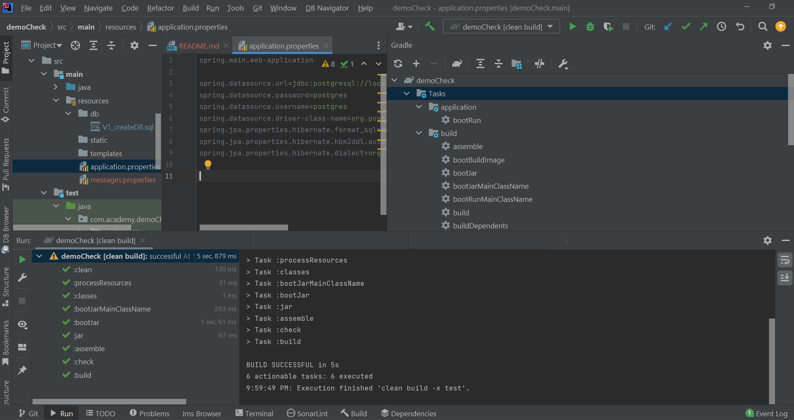
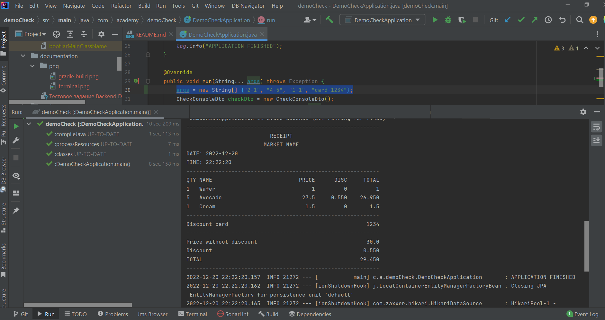
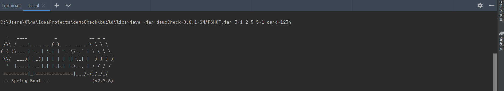
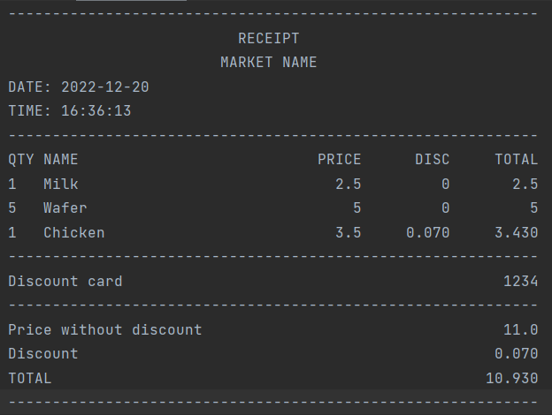

<h1>Backend Dev Course</h1>
<h2>Test task - Check Creator</h2>

# Task Description
### [Task](./documentation/Тестовое задание Backend Dev Course.pdf)

## List of used technologies
● Spring Boot ● Gradle  ● Postgresql
● Spring Data JPA ● Hibernate
● Lombok ● Mapstruct ● jUnit ● Mockito

## Getting Started

Local Startup with Gradle 7.5

 Java version 17+ is required.

#### Clone the repository
  
>Intellij IDEA -> Git -> Clone -> Url -> https://github.com/kursonchik/demoCheck

or

```console
git clone https://github.com/kursonchik/demoCheck.git
```

### Create Postgres Database

Example:

```sql
CREATE DATABASE "test_shop"
    WITH
    OWNER = postgres
    ENCODING = 'UTF8'
    LC_COLLATE = 'English_World.1252'
    LC_CTYPE = 'English_World.1252'
    TABLESPACE = pg_default
    CONNECTION LIMIT = -1;
    
```
DDL operations are stored in src/main/resources/db/V1_createDB.sql;

database connection settings in application.properties

### 1) Run Gradle

```console
gradle clean build -x test
```


---
###2) Run DemoCheckApplication

1)Run method main() 
src/main/java/com/academy/demoCheck/DemoCheckApplication.java.main()

2)you can change these parameters of the check in the method run() {"2-1", "4-5", "1-1", "card-1234"};


---

###Run with Terminal
for example
>C:\{path}\demoCheck\build\libs>java -jar demoCheck-0.0.1-SNAPSHOT.jar 3-1 2-5 5-1 card-1234

check your path to the folder "libs" and name file.jar

also you can change the parameters of the check in the line 3-1 2-5 5-1 card-1234


---

## Demo
Сheck example in output file demoCheck/documentation/output


